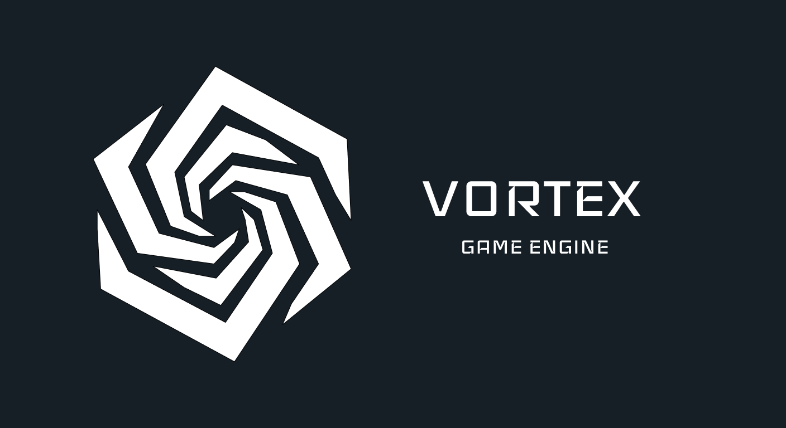
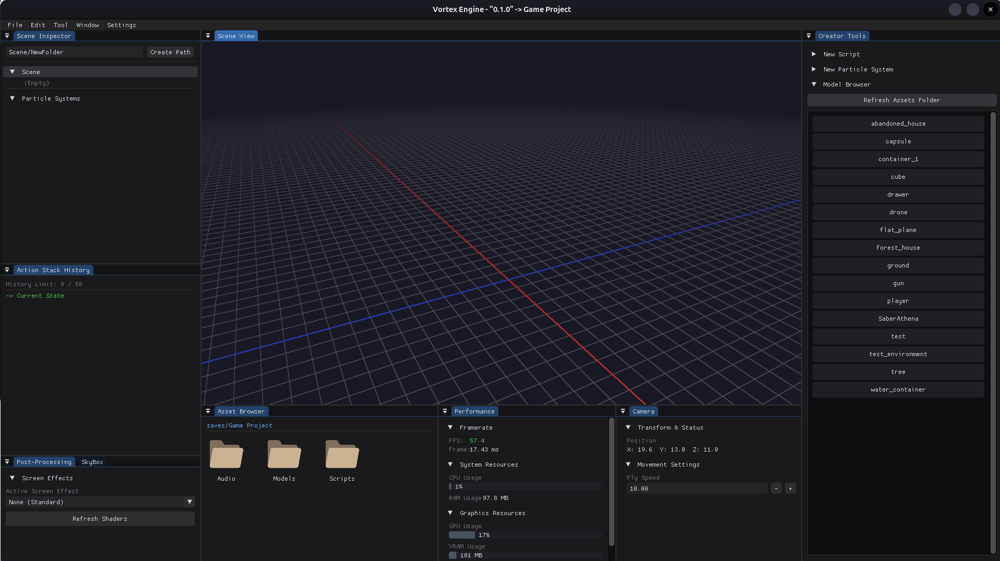
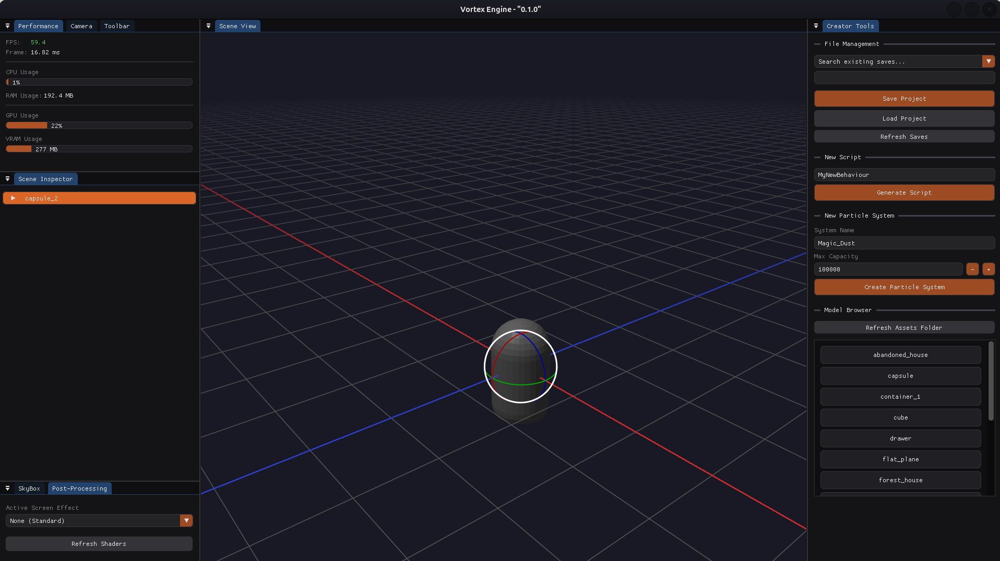
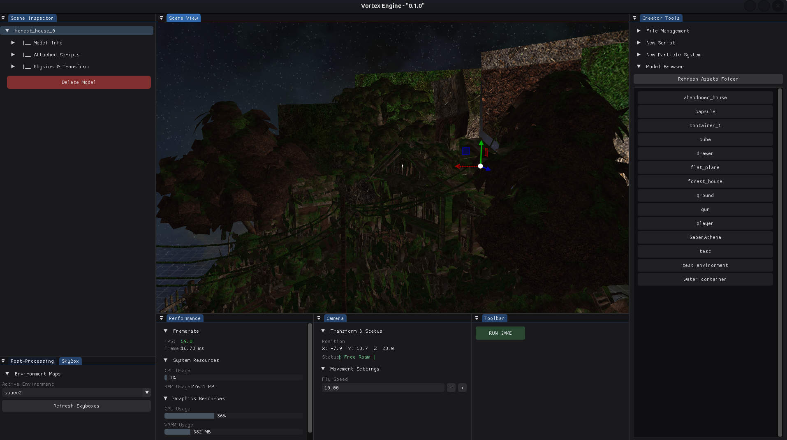

# Vortex Engine
**(Note: I am building this to learn engine architecture, openGL and in the future Vulkan, so expect rough edges as I figure out what I am doing!)**

<p align="center">
  
</p>

<p align="center">
  
</p>

Vortex Engine is a personal project currently in its early development stages. It serves as a foundational bridge between basic rendering and a complete game engine, focusing heavily on low-level systems like memory management and pipeline optimization.

While many core features are working, the engine is actively evolving. Many standard features, including complex lighting and a scene hierarchy are on the roadmap. This project follows a bottom-up approach to ensure a fast, efficient, and highly optimized base for future implementations.

## Prerequisites
Vortex Engine is currently built for Linux (Ubuntu/Debian).

## Installation and Building

The easiest way to get started is by running the included setup script. This script automatically fetches the required Linux headers and graphics libraries, compiles the engine, and sets up a desktop application shortcut so you can launch it directly from your app menu without using the terminal.

### Method 1: Automated Setup (Recommended)

1. **Clone the repository**

```bash
git clone git@github.com:Mashhood-Husnain/Vortex-Game-Engine.git
cd Vortex-Game-Engine
```

2. **Run the setup script**

Depending on your preferred shell, run either the Bash or Fish script. This handles all dependencies, compilation, and OS integration:

```bash
# For Bash users
chmod +x setup_linux.sh
./setup_linux.sh

# For Fish users
chmod +x setup_linux.fish
./setup_linux.fish
```

Once the script completes, you can simply open your Linux application menu, search for Vortex Engine, and launch it!

### Method 2: Manual Setup (Fallback)

If the setup script fails for some reason, or if you prefer to build the environment yourself, follow these manual steps.

1. **Install dependencies**

Troubleshooting: You can check for missing packages by generating the build files with cmake -B build. CMake will output a list of any missing dependencies (like Wayland, X11, or OpenGL headers) that you need to install via your package manager.

2. **Compile the engine**

Once your dependencies are installed, generate the build files and compile using all available CPU cores:

```bash
mkdir -p build
cd build
cmake -DCMAKE_BUILD_TYPE=Release ..
make -j$(proc)
```

3. Run the engine

```bash
./engine
```

4. **Manual Desktop Integration (Optional)**

If you compiled manually but still want Vortex Engine to appear in your system's application launcher, you can create the app shortcut yourself.

First, copy the icon to your system's icon folder:

```bash
mkdir -p ~/.local/share/icons
cp ../Vortex/assets/branding/vortex_icon.png ~/.local/share/icons/vortex_icon.png
```

Next, create the .desktop file:

```bash
nano ~/.local/share/applications/vortex-engine.desktop
```

Paste the following configuration into the file. **Important**: Replace /path/to/Vortex-Game-Engine with the actual absolute path to your cloned repository:

```bash
[Desktop Entry]
Version=1.0
Type=Application
Name=Vortex Engine
Comment=Custom C++ 3D Game Engine
Exec=env -C "/path/to/Vortex-Game-Engine/Vortex" "/path/to/Vortex-Game-Engine/build/engine"
Icon=vortex_icon
Terminal=false
Categories=Development;3DGraphics;
```

Finally, make the shortcut executable and update the desktop database so your OS recognizes it:


```bash
chmod +x ~/.local/share/applications/vortex-engine.desktop
update-desktop-database ~/.local/share/applications
```

## Using the engine
### Scripting
All gameplay scripts are stored in the Vortex/Game/Scripts directory.
  - You can create new scripts directly through the engine's Creator Tool window.
  - Simply specify the name of the file, click create, and then open the file in your preferred IDE to write your C++ code.

### Editor Controls
When you launch the engine, you will start in Editor Mode attached to the default camera. When you enter Play Mode, these default controls are disassociated from the camera so you can use them in your own game scripts.

| Key | Action (Editor Mode) |
| --- | --- |
| **W, A, S, D** | Move camera horizontally |
| **Q, E** | Move camera up / down |
| **M** | Release/Capture Mouse (Use this to interact with the Creator Tool or Inspector) |
| **Z** | Toggle Wireframe view for all models |
| **F** | Toggle Fullscreen / Windowed mode |
| **V** | Toggle XYZ Gizmo |
| **R** | Toggle for Rotating object |
| **T** | Toggle for Translating object |
| **Y** | Toggle for Scaling object |
| **TAB** | Toggle Engine Stats view in Play Mode (this binding only works in Play Mode)|
| **LEFT CTRL + Mouse Drag** | Snap selected model to grid |
| **LEFT ALT** | Snap selected model to the ground |
| **LEFT CTRL + P** | Toggle Engine Terminal |
| **LEFT CTRL + S** | Save the Current Project |
| **LEFT CTRL + D** | Duplicate Current Selected Model(s) |
| **Right Mouse Click (on folder)** | Options for Folders |
| **Escape** | Exit Play Mode (if playing) OR Exit Engine (if in editor) |


<p align="center">
  
</p>

<p align="center">
  
</p>
